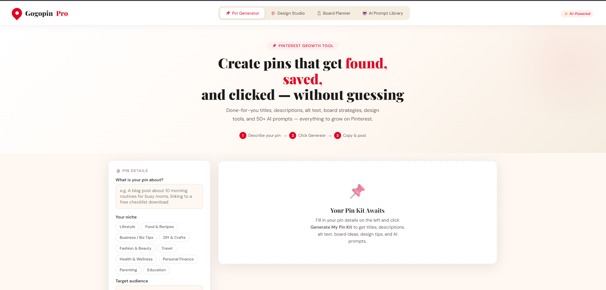
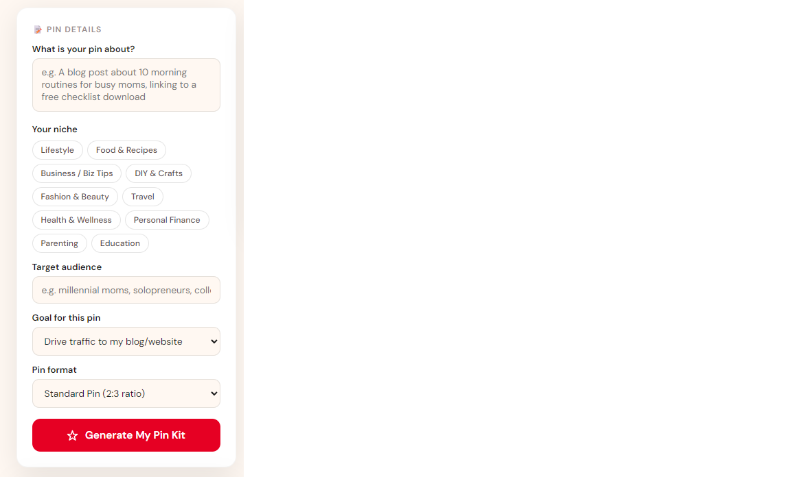

# Gogopin Pro: Pinterest Pin Creation Tool

> Generate high-converting Pinterest pins in seconds. No design skills needed.

**For:** UGC creators, solopreneurs, affiliate marketers, and small brands who need 50+ unique pins/week without hiring a designer.

---

## What Problem Does This Solve?

Pinterest pins get buried if they all look the same. You need variety—fast.

- **Designing 50 pins manually** = 10+ hours/week
- **Hiring a designer** = $500–2k/month
- **Guessing what works** = Low saves, low clicks

**Gogopin Pro generates a complete Pin Kit from a single input.** Fill in your topic. Click Generate. Get titles, descriptions, keywords, board ideas, design prompts, and scoring—all in seconds.

---

## What You Get (Every Time)

| Feature | Output |
|---------|--------|
| **Titles** | 3 keyword-rich, click-worthy options |
| **Descriptions** | 2 SEO-optimized descriptions with CTAs |
| **Alt Text** | Field-ready sentence for accessibility |
| **Keywords** | 7–9 ranked keywords with strength ratings |
| **Pin Scores** | SEO, Clickability & Saveability (1–100 scale) |
| **Board Ideas** | 5 strategic board names + descriptions |
| **Design Tips** | 6 actionable tips for scroll-stopping visuals |
| **AI Prompts** | Copy-paste prompts for Canva AI & Ideogram |

---

## Quick Start (2 Minutes)

### 1. Open the tool
Open gogopin-pro.html in any modern web browser
(Chrome, Safari, Firefox, Edge — no installation needed)

### 2. Fill in your pin details
- **What is your pin about?** → Be specific (product, blog post, freebie, topic)
- **Your niche** → Select your category
- **Target audience** → Who is this for? (e.g., busy moms, freelance designers)
- **Goal** → Traffic, saves, leads, sales, or awareness?
- **Pin format** → Standard, Idea/Video, Story, or Infographic

### 3. Click "Generate My Pin Kit"
Your full kit appears in seconds on the right.

### 4. Copy and use
Each section has a Copy button. Paste into Pinterest, Canva, Ideogram, or your scheduler.

---

## 📊 Example Output
### Input: Base Design

*Upload a PNG (1000×1000px or larger). No design skills needed.*

### Settings: Configure Variations

*Enter 3–5 text variations. Choose a color palette. The tool generates the rest.*

### Output: Download Your Pin(s)

### Input (What you provide)
"A blog post about 5 easy meal prep ideas for busy working moms, linking to a free weekly meal plan PDF download"

### Output (What you get)

**Titles**
- 5 Easy Meal Prep Recipes for Busy Moms (Save 6 Hours This Week)
- Weekly Meal Prep Ideas That Actually Save Time
- Free Meal Prep Plan for Working Moms (Get 50% More Dinners Done)

**Descriptions**
- Discover 5 simple meal prep recipes that working moms love. Save hours, eat healthy, stress less. Free printable meal plan included.

**Board Ideas**
- Meal Prep for Busy Moms | Easy weekly recipes to save time, stress, and money
- Working Mom Hacks | Time-saving recipes, schedules, and sanity tips

**AI Design Prompt (for Canva)**
Create a modern Pinterest pin (1000×1500px) for busy moms.
Hero text: "5 Easy Meal Prep Ideas"
Color mood: Warm, inviting (sage green + cream + warm orange accents)
Style: Clean, minimalist photography with hand-written typography overlay
Include: A bowl of colorful prepped vegetables, natural lighting

---

## Input Tips (Better Input = Better Output)

✅ Describe what the pin **links to** (blog post, product page, freebie, video)
✅ Mention your **offer** if there is one (e.g., "free meal plan PDF")
✅ Include your **target keyword** if you already know it
✅ **One topic per generation** — don't combine multiple ideas
✅ Use the AI prompts directly in **Canva AI** or **Ideogram**

❌ Avoid: Vague descriptions ("marketing stuff"), multiple topics in one input, unclear CTAs

---

##  How to Use AI Design Prompts

### Canva AI (Magic Media)
1. Copy the prompt from the **Canva AI tab**
2. Paste into Canva's Magic Media or AI image generator
3. Canva generates a visual based on your prompt
4. Customize colors, text, and layout as needed

### Ideogram
1. Copy the prompt from the **Ideogram tab**
2. Go to **ideogram.ai** and paste
3. Ideogram specializes in typography-forward, stylized pins
4. Great for pins where text is part of the visual design

---

## How to Use Board Ideas

Your 5 suggested boards are keyword-optimized and audience-aligned.

1. Go to your Pinterest profile → Click **+** to create a new board
2. Use the suggested **board name exactly as written**
3. Paste the board description into the board's **"About" field**
4. Save your pin to the most relevant board first (improves ranking)

---

## 📈 Understanding Your Pin Scores

After generating, you'll see three scores:

- **SEO Score** — How well your keywords align with Pinterest search
- **Click Score** — How likely the title/description drives clicks
- **Save Score** — How likely the pin concept gets saved & re-pinned

**Target:** 70+ across all three for best results.
**Lower scores?** Add more specific keywords or a stronger benefit statement.

---

## 🛠️ Technical Details

| Aspect | Details |
|--------|---------|
| **File Type** | Single HTML file — no frameworks, no dependencies |
| **AI Engine** | Powered by Anthropic Claude API (claude-sonnet-4) |
| **Browser Support** | All modern browsers (Chrome, Safari, Firefox, Edge) |
| **Mobile** | Fully responsive — works on phones & tablets |
| **Installation** | None — just open in a browser |
| **Data Privacy** | Runs locally in your browser (no data stored on servers) |

**********Creative Commons Attribution-NonCommercial License***********

You can share and modify this work, but NOT for commercial purposes.
For commercial use, contact theugcmaverik@gmail.com.

**********For personal/educational use only, you may self-host using GitHub Pages or Netlify.**********

## 📋 Files Included

pinterest-tools/
├── gogopin-pro.html          Main application (open in browser)
├── README.md                 This documentation
└── LICENSE                   MIT License (free to use & modify)

---

## 📅 Recommended Workflow

Use Gogopin Pro as part of a **weekly batch system**:

**Sunday** — Generate 5–10 Pin Kits for the week
**Monday–Tuesday** — Design using AI prompts in Canva or Ideogram
**Wednesday** — Upload to Pinterest or queue in Tailwind/Buffer
**Friday** — Check analytics, note top-performing titles/niches
**Repeat** — Use winning pin topics as inputs for variations

This system typically generates **20–50% more saves** than random posting.

---

## ✅ FAQ

**Q: Do I need to install anything?**
A: No. Just open gogopin-pro.html in your browser. No login, no account, no installation.

**Q: Where does my data go?**
A: Everything runs in your browser. Your pins are never stored on our servers. You own all generated content.

**Q: Can I use this commercially?**
A: Yes. You own 100% of all pins you generate. Use them for your business, clients, or resell services built on this tool.

**Q: What if the AI output isn't good?**
A: The quality depends on your input. Be as specific as possible about what the pin links to, your audience, and your goal. Vague inputs = vague outputs.

**Q: Does this work on mobile?**
A: Yes. It's fully responsive. You can generate pins on your phone or tablet.

**Q: Can I modify the code?**
A: Yes. This is open-source (MIT License). Fork it, customize it, redistribute it. Just keep the license attribution.

---

## 🤝 Support & Feedback

Have a question or found a bug?
- **Issues** → Open a GitHub issue in this repo
- **Questions** → Start a Discussion in this repo
- **Feature requests** → Let us know what you'd like to see

---

## 📄 License

MIT License — Use, modify, and distribute freely.
See the LICENSE file for full terms.

---

## 🎓 About This Tool

**Gogopin Pro** is part of the **@theugcmaverik** digital creator toolkit—built for AI-powered creators, solopreneurs, and small brands who want smarter marketing without the overwhelm.

**Built with:** HTML, CSS, JavaScript, Anthropic Claude API
**Last Updated:** July 2026
**Version:** 1.0.0

---

## 🎯 Next Steps

1. ⭐ Star this repo if you find it useful
2. 📧 Share with creators who need Pinterest help
3. 🐛 Report issues or suggest features
4. 🔧 Fork and customize for your needs

**Happy pinning!** 📌

